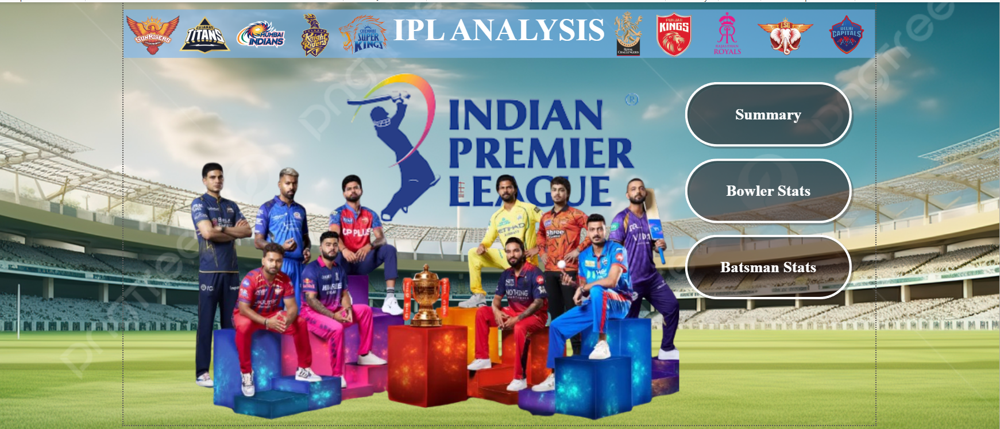
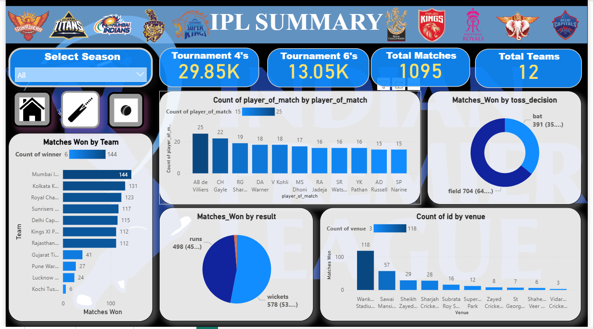
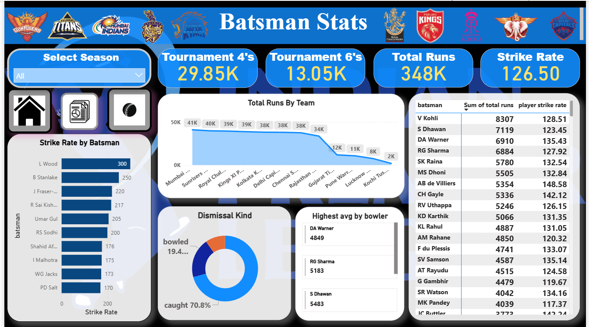
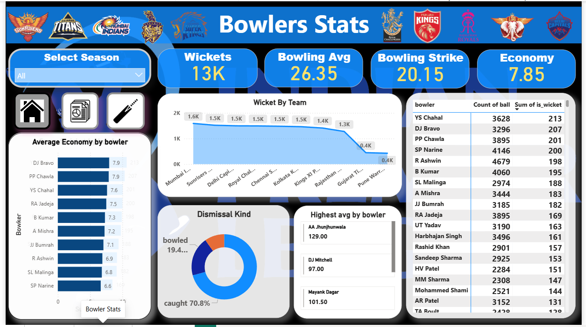

# 🏏 IPL Dashboard (Power BI)

## 📊 Overview
This project is an interactive Power BI dashboard that provides deep insights into IPL (Indian Premier League) data from 2008 to 2024.  
It helps analyze team performance, match outcomes, toss decisions, venue statistics, and player performance.

---

## 🎯 Objectives
- Analyze IPL match data effectively
- Identify winning patterns and trends
- Compare team performances
- Provide data-driven insights using visualizations

---

## 📁 Dataset
- IPL Matches Dataset (2008–2024)
- Contains:
  - Match results
  - Teams
  - Venues
  - Toss decisions
  - Player statistics

---

## ⚙️ Tools & Technologies Used
- Power BI (Data Visualization)
- Excel / CSV (Data Source)
- Data Cleaning & Transformation (Power Query)

---

## 📌 Features
- 📈 Total Matches, Teams, 4’s & 6’s Overview
- 🏆 Matches Won by Team Analysis
- 🎯 Toss Decision Impact (Bat vs Field)
- 📍 Venue-wise Match Distribution
- 👤 Player Performance Insights
- 📊 Interactive Filters (Season Selection)

---

## 📷 Dashboard Preview

### 🏠 Homepage

### 🏏 IPL Summary

### 🧑‍🏏 Batsman Stats

### 🎯 Bowler Stats

---

## 📊 Key Insights
- Mumbai Indians has the highest number of wins
- Teams chasing (field first) have higher win probability
- Some venues favor batting first
- Top players consistently dominate match performance

---

## 🚀 How to Use
1. Download the `.pbix` file from this repository  
2. Open it using Power BI Desktop  
3. Interact with filters and visuals  

---

## 📌 Future Improvements
- Add real-time IPL data
- Enhance player analytics
- Deploy dashboard online

---

## 👨‍💻 Author
**Dhruvil Ramani**

---

## ⭐ If you like this project
Give it a ⭐ on GitHub!
